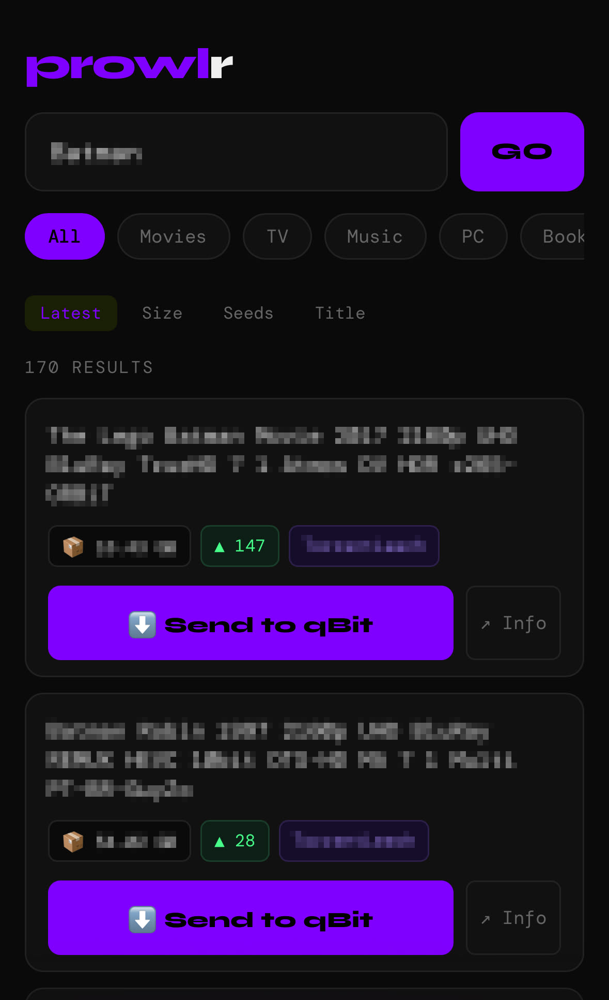

# Prowlr

**A mobile-first search UI for Prowlarr.** Browse all your configured indexers, filter by category, and send torrents to qBittorrent in one tap — no app install required, runs in any browser.

> Designed for phones and Android TV. Works on desktop too.



---

## Features

- Search across all Prowlarr indexers simultaneously
- Customizable category filter buttons
- Sort by date, size, seeders, or title
- One-tap send to qBittorrent via Prowlarr's native grab endpoint
- Confirmation dialog before sending
- Per-result link to the torrent info page
- Customizable colors
- Two files total — `prowlr.html` + `config.json`

---

## Requirements

- [Prowlarr](https://github.com/Prowlarr/Prowlarr) with at least one indexer configured
- qBittorrent set as a download client in Prowlarr
- Docker (or any web server)

---

## Setup

### 1. Clone the repo

```bash
git clone https://github.com/ThisIsIgnis/prowlr.git
cd prowlr
```

### 2. Edit config.json

Open `config.json` and fill in your details:

```json
{
  "prowlarr": "http://192.168.1.100:9696",
  "apikey": "your-prowlarr-api-key",
  "categories": [
    { "name": "Movies", "id": 2000 },
    { "name": "TV",     "id": 5000 },
    { "name": "Music",  "id": 1000 },
    { "name": "PC",     "id": 4000 },
    { "name": "Books",  "id": 8000 }
  ],
  "accent":  "#e8ff47",
  "bg":      "#0a0a0a",
  "surface": "#111111",
  "text":    "#f0f0f0"
}
```

**Where to find your Prowlarr API key:** Prowlarr → Settings → General → API Key

### 3. Start

```bash
docker compose up -d
```

Open `http://localhost:8989`. Done.

---

## Configuration reference

### Connection

| Key | Description | Example |
|---|---|---|
| `prowlarr` | Base URL of your Prowlarr instance | `http://192.168.1.100:9696` |
| `apikey` | Prowlarr API key | `abc123...` |

### Categories

Each entry needs a `name` (the button label) and an `id` (Prowlarr category ID).

Common category IDs:

| Category | ID |
|---|---|
| Movies | 2000 |
| TV | 5000 |
| Music | 1000 |
| PC / Software | 4000 |
| Books | 8000 |
| XXX | 6000 |
| Other | 7000 |

Add, remove, or rename entries freely. Changes take effect after restarting the container (or hard-refreshing the browser if serving manually).

### Colors

| Key | Description | Default |
|---|---|---|
| `accent` | Buttons, highlights, title | `#e8ff47` |
| `bg` | Page background | `#0a0a0a` |
| `surface` | Cards, inputs | `#111111` |
| `text` | Primary text | `#f0f0f0` |

---

## Updating config

Edit `config.json` on the server, then hard-refresh the browser (`Ctrl+Shift+R`). No container restart needed since the file is mounted read-only and served statically.

---


## Homarr integration

Prowlr works great as an iFrame widget in [Homarr](https://github.com/ajnart/homarr). Add it to your dashboard for quick access alongside your other services.

1. Edit your Homarr dashboard
2. Add a new **iFrame** widget
3. Set the URL to your Prowlr instance — e.g. `http://localhost:8989`
4. Resize to taste

## How sending works

When you tap **Send to qBit**, Prowlr calls Prowlarr's grab endpoint with the result's `guid` and `indexerId`. Prowlarr forwards the torrent to qBittorrent internally. The browser never talks to qBittorrent directly.

---

## Updating Prowlr

```bash
git pull
docker compose up -d
```

`config.json` is not touched by updates.

---

## License

MIT
